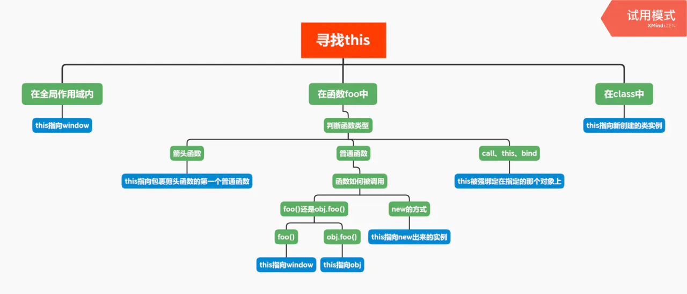
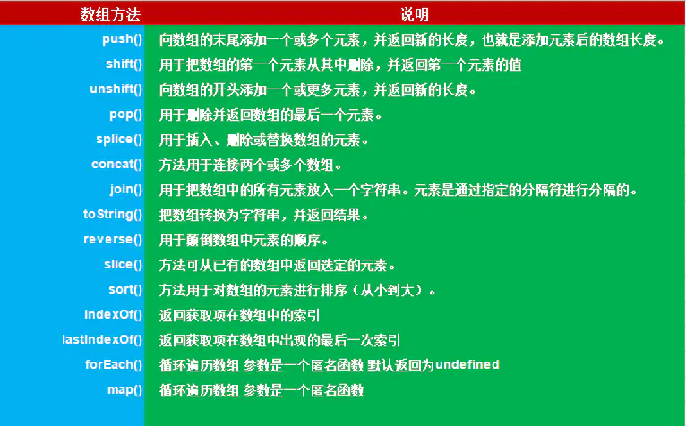
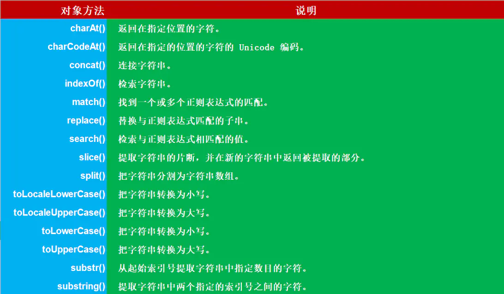
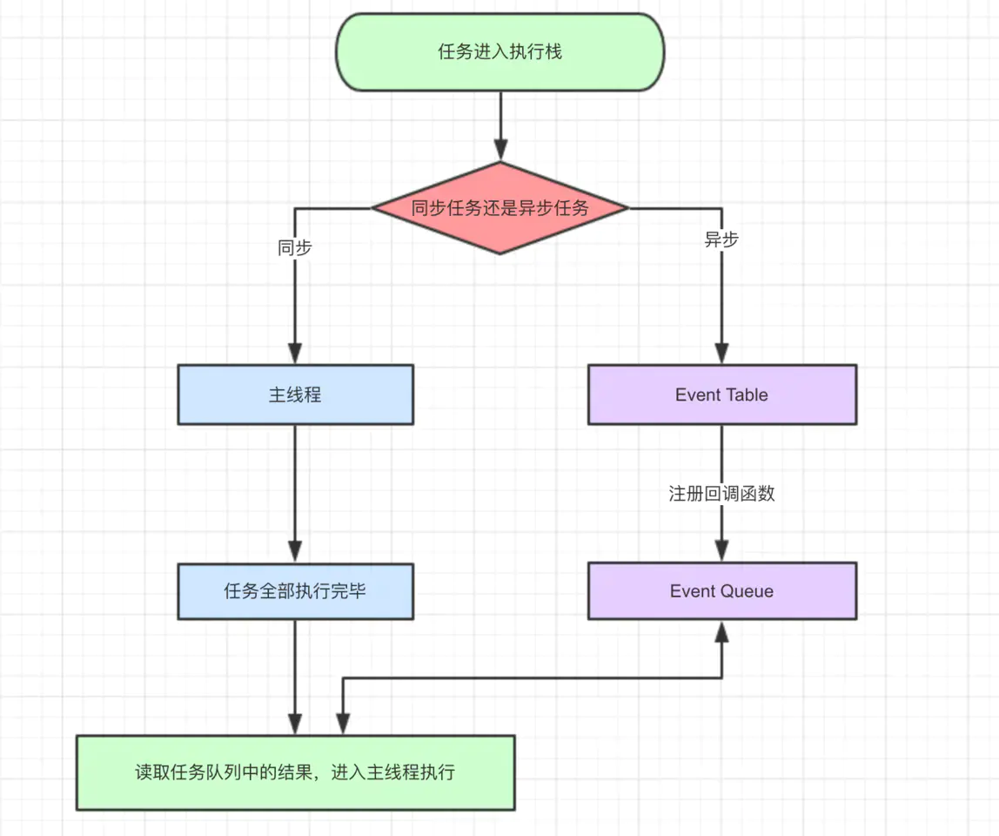

## 思维导图

知识点如下： 


## 1.js的数据类型，值的存储
JavaScript一共有8种数据类型，其中有7种基本数据类型：Undefined、Null、Boolean、Number、String、Symbol（es6新增，表示独一无二的值）和BigInt（es10新增）；
1种引用数据类型——Object（Object本质上是由一组无序的名值对组成的）。里面包含 function、Array、Date等。JavaScript不支持任何创建自定义类型的机制，而所有值最终都将是上述 8 种数据类型之一。
原始数据类型：直接存储在栈（stack）中，占据空间小、大小固定，属于被频繁使用数据，所以放入栈中存储。
引用数据类型：同时存储在栈（stack）和堆（heap）中，占据空间大、大小不固定。引用数据类型在栈中存储了指针，该指针指向堆中该实体的起始地址。当解释器寻找引用值时，会首先检索其在栈中的地址，取得地址后从堆中获得实体。

## 2.数据类型判断（typeof, instanceof, constructor, Object.prototype.toString.call()）

### (1) typeof
typeof只能判断原始类型，对应Array, Function这些不能判断
```
console.log(typeof 2);               // number
console.log(typeof true);            // boolean
console.log(typeof 'str');           // string
console.log(typeof []);              // object     []数组的数据类型在 typeof 中被解释为 object
console.log(typeof function(){});    // function
console.log(typeof {});              // object
console.log(typeof undefined);       // undefined
console.log(typeof null);            // object     null 的数据类型被 typeof 解释为 object
```
### (2) instanceof
instanceof 可以正确的判断对象的类型，因为内部机制是通过判断对象的原型链中是不是能找到类型的 prototype。
```
console.log(2 instanceof Number);                    // false
console.log(true instanceof Boolean);                // false 
console.log('str' instanceof String);                // false  
console.log([] instanceof Array);                    // true
console.log(function(){} instanceof Function);       // true
console.log({} instanceof Object);                   // true    
// console.log(undefined instanceof Undefined);
// console.log(null instanceof Null);
```
### (3) constructor
注意，如果改变对象的原型，construcor就失效。
```
console.log((2).constructor === Number); // true
console.log((true).constructor === Boolean); // true
console.log(('str').constructor === String); // true
console.log(([]).constructor === Array); // true
console.log((function() {}).constructor === Function); // true
console.log(({}).constructor === Object); // true
```
### (4) Object.prototype.toString.call()
借用Object的 toString 方法
```
var a = Object.prototype.toString;
 
console.log(a.call(2));
console.log(a.call(true));
console.log(a.call('str'));
console.log(a.call([]));
console.log(a.call(function(){}));
console.log(a.call({}));
console.log(a.call(undefined));
console.log(a.call(null));
```

## 3.js的内置对象
常用的内置对象。
```
（1）值属性，这些全局属性返回一个简单值，这些值没有自己的属性和方法。

例如 Infinity、NaN、undefined、null 字面量

（2）函数属性，全局函数可以直接调用，不需要在调用时指定所属对象，执行结束后会将结果直接返回给调用者。

例如 eval()、parseFloat()、parseInt() 等

（3）基本对象，基本对象是定义或使用其他对象的基础。基本对象包括一般对象、函数对象和错误对象。

例如 Object、Function、Boolean、Symbol、Error 等

（4）数字和日期对象，用来表示数字、日期和执行数学计算的对象。

例如 Number、Math、Date

（5）字符串，用来表示和操作字符串的对象。

例如 String、RegExp

（6）可索引的集合对象，这些对象表示按照索引值来排序的数据集合，包括数组和类型数组，以及类数组结构的对象。例如 Array

（7）使用键的集合对象，这些集合对象在存储数据时会使用到键，支持按照插入顺序来迭代元素。

例如 Map、Set、WeakMap、WeakSet

（8）矢量集合，SIMD 矢量集合中的数据会被组织为一个数据序列。

例如 SIMD 等

（9）结构化数据，这些对象用来表示和操作结构化的缓冲区数据，或使用 JSON 编码的数据。

例如 JSON 等

（10）控制抽象对象

例如 Promise、Generator 等

（11）反射

例如 Reflect、Proxy

（12）国际化，为了支持多语言处理而加入 ECMAScript 的对象。

例如 Intl、Intl.Collator 等

（13）WebAssembly

（14）其他

```

## 4.null 和 undefined的区别
首先 Undefined 和 Null 都是基本数据类型，这两个基本数据类型分别都只有一个值，就是 undefined 和 null。
undefined 代表的含义是未定义，
null 代表的含义是空对象（其实不是真的对象，请看下面的注意！）。一般变量声明了但还没有定义的时候会返回 undefined，null
主要用于赋值给一些可能会返回对象的变量，作为初始化。

## 5.JavaScript的作用域和作用域链
*作用域*： 作用域是定义变量的区域，它有一套访问变量的规则，这套规则来管理浏览器引擎如何在当前作用域以及嵌套的作用域中根据变量（标识符）进行变量查找。  
*作用域链*： 作用域链的作用是保证对执行环境有权访问的所有变量和函数的有序访问，通过作用域链，我们可以访问到外层环境的变量和
函数。

## 6.JavaScript创建对象的几种方式
```
1）第一种是工厂模式，工厂模式的主要工作原理是用函数来封装创建对象的细节，从而通过调用函数来达到复用的目的。但是它有一个很大的问题就是创建出来的对象无法和某个类型联系起来，它只是简单的封装了复用代码，而没有建立起对象和类型间的关系。

（2）第二种是构造函数模式。js 中每一个函数都可以作为构造函数，只要一个函数是通过 new 来调用的，那么我们就可以把它称为构造函数。执行构造函数首先会创建一个对象，然后将对象的原型指向构造函数的 prototype 属性，然后将执行上下文中的 this 指向这个对象，最后再执行整个函数，如果返回值不是对象，则返回新建的对象。因为 this 的值指向了新建的对象，因此我们可以使用 this 给对象赋值。构造函数模式相对于工厂模式的优点是，所创建的对象和构造函数建立起了联系，因此我们可以通过原型来识别对象的类型。但是构造函数存在一个缺点就是，造成了不必要的函数对象的创建，因为在 js 中函数也是一个对象，因此如果对象属性中如果包含函数的话，那么每次我们都会新建一个函数对象，浪费了不必要的内存空间，因为函数是所有的实例都可以通用的。

（3）第三种模式是原型模式，因为每一个函数都有一个 prototype 属性，这个属性是一个对象，它包含了通过构造函数创建的所有实例都能共享的属性和方法。因此我们可以使用原型对象来添加公用属性和方法，从而实现代码的复用。这种方式相对于构造函数模式来说，解决了函数对象的复用问题。但是这种模式也存在一些问题，一个是没有办法通过传入参数来初始化值，另一个是如果存在一个引用类型如 Array 这样的值，那么所有的实例将共享一个对象，一个实例对引用类型值的改变会影响所有的实例。

（4）第四种模式是组合使用构造函数模式和原型模式，这是创建自定义类型的最常见方式。因为构造函数模式和原型模式分开使用都存在一些问题，因此我们可以组合使用这两种模式，通过构造函数来初始化对象的属性，通过原型对象来实现函数方法的复用。这种方法很好的解决了两种模式单独使用时的缺点，但是有一点不足的就是，因为使用了两种不同的模式，所以对于代码的封装性不够好。

（5）第五种模式是动态原型模式，这一种模式将原型方法赋值的创建过程移动到了构造函数的内部，通过对属性是否存在的判断，可以实现仅在第一次调用函数时对原型对象赋值一次的效果。这一种方式很好地对上面的混合模式进行了封装。

（6）第六种模式是寄生构造函数模式，这一种模式和工厂模式的实现基本相同，我对这个模式的理解是，它主要是基于一个已有的类型，在实例化时对实例化的对象进行扩展。这样既不用修改原来的构造函数，也达到了扩展对象的目的。它的一个缺点和工厂模式一样，无法实现对象的识别。
```

## 7.JavaScript继承的几种方式
```
（1）第一种是以原型链的方式来实现继承，但是这种实现方式存在的缺点是，在包含有引用类型的数据时，会被所有的实例对象所共享，容易造成修改的混乱。还有就是在创建子类型的时候不能向超类型传递参数。

（2）第二种方式是使用借用构造函数的方式，这种方式是通过在子类型的函数中调用超类型的构造函数来实现的，这一种方法解决了不能向超类型传递参数的缺点，但是它存在的一个问题就是无法实现函数方法的复用，并且超类型原型定义的方法子类型也没有办法访问到。

（3）第三种方式是组合继承，组合继承是将原型链和借用构造函数组合起来使用的一种方式。通过借用构造函数的方式来实现类型的属性的继承，通过将子类型的原型设置为超类型的实例来实现方法的继承。这种方式解决了上面的两种模式单独使用时的问题，但是由于我们是以超类型的实例来作为子类型的原型，所以调用了两次超类的构造函数，造成了子类型的原型中多了很多不必要的属性。

（4）第四种方式是原型式继承，原型式继承的主要思路就是基于已有的对象来创建新的对象，实现的原理是，向函数中传入一个对象，然后返回一个以这个对象为原型的对象。这种继承的思路主要不是为了实现创造一种新的类型，只是对某个对象实现一种简单继承，ES5 中定义的 Object.create() 方法就是原型式继承的实现。缺点与原型链方式相同。

（5）第五种方式是寄生式继承，寄生式继承的思路是创建一个用于封装继承过程的函数，通过传入一个对象，然后复制一个对象的副本，然后对象进行扩展，最后返回这个对象。这个扩展的过程就可以理解是一种继承。这种继承的优点就是对一个简单对象实现继承，如果这个对象不是我们的自定义类型时。缺点是没有办法实现函数的复用。

（6）第六种方式是寄生式组合继承，组合继承的缺点就是使用超类型的实例做为子类型的原型，导致添加了不必要的原型属性。寄生式组合继承的方式是使用超类型的原型的副本来作为子类型的原型，这样就避免了创建不必要的属性。
```
## 8.对this、call、apply和bind的理解
```
1.在浏览器里，在全局范围内this 指向window对象；
2.在函数中，this永远指向最后调用他的那个对象；
3.构造函数中，this指向new出来的那个新的对象；
4.call、apply、bind中的this被强绑定在指定的那个对象上；
5.箭头函数中this比较特殊,箭头函数this为父作用域的this，不是调用时的this.要知道前四种方式,都是调用时确定,也就是动态的,而箭头函数的this指向是静态的,声明的时候就确定了下来；
6.apply、call、bind都是js给函数内置的一些API，调用他们可以为函数指定this的执行,同时也可以传参。
```


## 9.JavaScript原型与原型链
在 js 中我们是使用构造函数来新建一个对象的，每一个构造函数的内部都有一个 prototype 属性值，这个属性值是一个对
象，这个对象包含了可以由该构造函数的所有实例共享的属性和方法。当我们使用构造函数新建一个对象后，在这个对象的内部
将包含一个指针，这个指针指向构造函数的 prototype 属性对应的值，在 ES5 中这个指针被称为对象的原型。一般来说我们
是不应该能够获取到这个值的，但是现在浏览器中都实现了 proto 属性来让我们访问这个属性，但是我们最好不要使用这
个属性，因为它不是规范中规定的。ES5 中新增了一个 Object.getPrototypeOf() 方法，我们可以通过这个方法来获取对
象的原型。  
  
当我们访问一个对象的属性时，如果这个对象内部不存在这个属性，那么它就会去它的原型对象里找这个属性，这个原型对象又
会有自己的原型，于是就这样一直找下去，也就是原型链的概念。原型链的尽头一般来说都是 Object.prototype 所以这就 是我们新建的对象为什么能够使用 toString() 等方法的原因。

## 10.JavaScript获取原型的方法
* p.proto
* p.constructor.prototypr
* Object.getPrototyprOf(p)

## 11.闭包
**闭包是指有权访问另一个函数作用域内变量的函数**，创建闭包的最常见的方式就是在一个函数内创建另一个函数，创建的函数可以访问到当前函数的局部变量。
  
闭包有两个常用的用途。

> 闭包的第一个用途是使我们在函数外部能够访问到函数内部的变量。通过使用闭包，我们可以通过在外部调用闭包函数，从而在外部访问到函数内部的变量，可以使用这种方法来创建私有变量。
> 函数的另一个用途是使已经运行结束的函数上下文中的变量对象继续留在内存中，因为闭包函数保留了这个变量对象的引用，所以这个变量对象不会被回收。

## 12.三种事件模型
1. **DOM0级模型**：这种模型不会传播，所以没有事件流的概念，但是现在有的浏览器支持以冒泡的方式实现，它可以在网页中直接定义监听函数，也可以通过 js属性来指定监听函数。这种方式是所有浏览器都兼容的。
2. **IE 事件模型**： 在该事件模型中，一次事件共有两个过程，事件处理阶段，和事件冒泡阶段。事件处理阶段会首先执行目标元素绑定的监听事件。然后是事件冒泡阶段，冒泡指的是事件从目标元素冒泡document，依次检查经过的节点是否绑定了事件监听函数，如果有则执行。这种模型通过 attachEvent 来添加监听函数，可以添加多个监听函数，会按顺序依次执行。
3. **DOM2 级事件模型**： 在该事件模型中，一次事件共有三个过程，第一个过程是事件捕获阶段。捕获指的是事件从 document 一直向下传播到目标元素，依次检查经过的节点是否绑定了事件监听函数，如果有则执行。后面两个阶段和 IE 事件模型的两个阶段相同。这种事件模型，事件绑定的函数是 addEventListener，其中第三个参数可以指定事件是否在捕获阶段执行。

## 13.事件委托
**事件委托** 本质上是利用了浏览器事件冒泡的机制。因为事件在冒泡过程中会上传到父节点，并且父节点可以通过事件对象获取到 目标节点，因此可以把子节点的监听函数定义在父节点上，由父节点的监听函数统一处理多个子元素的事件，这种方式称为事件代理。

## 14.DOM操作

### (1) 创建新节点
```
    createDocumentFragment()    //创建一个DOM片段
    createElement()   //创建一个具体的元素
    createTextNode()   //创建一个文本节点
```
### (2) 添加、移除、替换、插入
```
    appendChild(node)
    removeChild(node)
    replaceChild(new,old)
    insertBefore(new,old)
```
### (3) 查找
```
    getElementById();
    getElementsByName();
    getElementsByTagName();
    getElementsByClassName();
    querySelector();
    querySelectorAll();
```
### (4) 属性操作
```
    getAttribute(key);
    setAttribute(key, value);
    hasAttribute(key);
    removeAttribute(key);
```

## 15.数组和字符串方法



## 16. AJAX
```javascript
//(1) 原生js
//1：创建Ajax对象
var xhr = window.XMLHttpRequest?new XMLHttpRequest():new ActiveXObject('Microsoft.XMLHTTP');// 兼容IE6及以下版本
//2：配置 Ajax请求地址
xhr.open('get','index.xml',true);
//3：发送请求
xhr.send(null); // 严谨写法
//4:监听请求，接受响应
xhr.onreadysatechange=function(){
     if(xhr.readySate==4&&xhr.status==200 || xhr.status==304 )
          console.log(xhr.responsetXML)
}

//(2) jquery
  $.ajax({
          type:'post',
          url:'',
          async:ture,//async 异步  sync  同步
          data:data,//针对post请求
          dataType:'jsonp',
          success:function (msg) {

          },
          error:function (error) {

          }
        })

//(3)promise疯转

function getJSON(url) {
  // 创建一个 promise 对象
  let promise = new Promise(function(resolve, reject) {
    let xhr = new XMLHttpRequest();

    // 新建一个 http 请求
    xhr.open("GET", url, true);

    // 设置状态的监听函数
    xhr.onreadystatechange = function() {
      if (this.readyState !== 4) return;

      // 当请求成功或失败时，改变 promise 的状态
      if (this.status === 200) {
        resolve(this.response);
      } else {
        reject(new Error(this.statusText));
      }
    };

    // 设置错误监听函数
    xhr.onerror = function() {
      reject(new Error(this.statusText));
    };

    // 设置响应的数据类型
    xhr.responseType = "json";

    // 设置请求头信息
    xhr.setRequestHeader("Accept", "application/json");

    // 发送 http 请求
    xhr.send(null);
  });

  return promise;
}
```

## 17.js延迟加载的方式
js 的加载、解析和执行会阻塞页面的渲染过程，因此我们希望 js 脚本能够尽可能的延迟加载，提高页面的渲染速度。
我了解到的几种方式是：  

1. 将 js 脚本放在文档的底部，来使 js 脚本尽可能的在最后来加载执行。
2. 给 js 脚本添加 defer属性，这个属性会让脚本的加载与文档的解析同步解析，然后在文档解析完成后再执行这个脚本文件，这样的话就能使页面的渲染不被阻塞。多个设置了 defer 属性的脚本按规范来说最后是顺序执行的，但是在一些浏览器中可能不是这样。
3. 给 js 脚本添加 async属性，这个属性会使脚本异步加载，不会阻塞页面的解析过程，但是当脚本加载完成后立即执行 js脚本，这个时候如果文档没有解析完成的话同样会阻塞。多个 async 属性的脚本的执行顺序是不可预测的，一般不会按照代码的顺序依次执行。
4. 动态创建 DOM 标签的方式，我们可以对文档的加载事件进行监听，当文档加载完成后再动态的创建 script 标签来引入 js 脚本。

## 18.js的几种模块规范
* 第一种是 CommonJS 方案，它通过 require 来引入模块，通过 module.exports 定义模块的输出接口。这种模块加载方案是服务器端的解决方案，它是以同步的方式来引入模块的，因为在服务端文件都存储在本地磁盘，所以读取非常快，所以以同步的方式加载没有问题。但如果是在浏览器端，由于模块的加载是使用网络请求，因此使用异步加载的方式更加合适。
* 第二种是 AMD 方案，这种方案采用异步加载的方式来加载模块，模块的加载不影响后面语句的执行，所有依赖这个模块的语句都定义在一个回调函数里，等到加载完成后再执行回调函数。require.js 实现了 AMD 规范。
* 第三种是 CMD 方案，这种方案和 AMD 方案都是为了解决异步模块加载的问题，sea.js 实现了 CMD 规范。它和require.js的区别在于模块定义时对依赖的处理不同和对依赖模块的执行时机的处理不同。
* 第四种方案是 ES6 提出的方案，使用 import 和 export 的形式来导入导出模块。

## 19.ES6 模块与 CommonJS 模块、AMD、CMD 的差异。
1. CommonJS 模块输出的是一个值的拷贝，ES6 模块输出的是值的引用。CommonJS 模块输出的是值的，也就是说，一旦输出一个值，模块内部的变化就影响不到这个值。ES6 模块的运行机制与 CommonJS 不一样。JS 引擎对脚本静态分析的时候，遇到模块加载命令 import，就会生成一个只读引用。等到脚本真正执行时，再根据这个只读引用，到被加载的那个模块里面去取值。
2. CommonJS 模块是运行时加载，ES6 模块是编译时输出接口。CommonJS 模块就是对象，即在输入时是先加载整个模块，生成一个对象，然后再从这个对象上面读取方法，这种加载称为“运行时加载”。而 ES6 模块不是对象，它的对外接口只是一种静态定义，在代码静态解析阶段就会生成。

## 20.requireJS的核心原理
```
require.js 的核心原理是通过动态创建 script 脚本来异步引入模块，然后对每个脚本的 load 事件进行监听，如果每个脚本都加载完成了，再调用回调函数。
```
 
## 21.谈谈JS的运行机制
### 1.js单线程
JavaScript语言的一大特点就是单线程，即同一时间只能做一件事情。
```
avaScript的单线程，与它的用途有关。作为浏览器脚本语言，JavaScript的主要用途是与用户互动，以及操作DOM。这决定了它只能是单线程，否则会带来很复杂的同步问题。比如，假定JavaScript同时有两个线程，一个线程在某个DOM节点上添加内容，另一个线程删除了这个节点，这时浏览器应该以哪个线程为准？
所以，为了避免复杂性，从一诞生，JavaScript就是单线程，这已经成了这门语言的核心特征，将来也不会改变。
``` 
### 2.js事件循环
js代码执行过程中会有很多任务，这些任务总的分成两类
```
* 同步任务
* 异步任务
``` 

我们解释一下这张图：

* 同步和异步任务分别进入不同的执行"场所"，同步的进入主线程，异步的进入Event Table并注册函数。
* 当指定的事情完成时，Event Table会将这个函数移入Event Queue。
* 主线程内的任务执行完毕为空，会去Event Queue读取对应的函数，进入主线程执行。
* 上述过程会不断重复，也就是常说的Event Loop(事件循环)。

那主线程执行栈何时为空呢？js引擎存在monitoring process进程，会持续不断的检查主线程执行栈是否为空，一旦为空，就会去Event Queue那里检查是否有等待被调用的函数。  
  
以上就是js运行的整体流程  
  
需要注意的是除了同步任务和异步任务，任务还可以更加细分为macrotask(宏任务)和microtask(微任务)，js引擎会优先执行微任务
```
微任务包括了 promise 的回调、node 中的 process.nextTick 、对 Dom 变化监听的 MutationObserver。

宏任务包括了 script 脚本的执行、setTimeout ，setInterval ，setImmediate 一类的定时事件，还有如 I/O 操作、UI 渲
染等。
```
*总结*：

1. 首先js 是单线程运行的，在代码执行的时候，通过将不同函数的执行上下文压入执行栈中来保证代码的有序执行。
2. 在执行同步代码的时候，如果遇到了异步事件，js 引擎并不会一直等待其返回结果，而是会将这个事件挂起，继续执行执行栈中的其他任务
3. 当同步事件执行完毕后，再将异步事件对应的回调加入到与当前执行栈中不同的另一个任务队列中等待执行。
4. 任务队列可以分为宏任务对列和微任务对列，当当前执行栈中的事件执行完毕后，js 引擎首先会判断微任务对列中是否有任务可以执行，如果有就将微任务队首的事件压入栈中执行。
5. 当微任务对列中的任务都执行完成后再去判断宏任务对列中的任务。

最后可以用下面一道题检测一下收获：
```
setTimeout(function() {
  console.log(1)
}, 0);
new Promise(function(resolve, reject) {
  console.log(2);
  resolve()
}).then(function() {
  console.log(3)
});
process.nextTick(function () {
  console.log(4)
})
console.log(5)
```
第一轮：主线程开始执行，遇到setTimeout，将setTimeout的回调函数丢到宏任务队列中，在往下执行new Promise立即执行，输出2，then的回调函数丢到微任务队列中，再继续执行，遇到process.nextTick，同样将回调函数扔到为任务队列，再继续执行，输出5，当所有同步任务执行完成后看有没有可以执行的微任务，发现有then函数和nextTick两个微任务，先执行哪个呢？process.nextTick指定的异步任务总是发生在所有异步任务之前，因此先执行process.nextTick输出4然后执行then函数输出3，第一轮执行结束。
第二轮：从宏任务队列开始，发现setTimeout回调，输出1执行完毕，因此结果是25431

## 22. arguments 的对象是什么？
arguments对象是函数中传递的参数值的集合。它是一个类似数组的对象，因为它有一个length属性，我们可以使用数组索引表示法arguments[1]来访问单个值，但它没有数组中的内置方法，如：forEach、reduce、filter和map。  
我们可以使用Array.prototype.slice将arguments对象转换成一个数组。
```javascript
function one() {
  return Array.prototype.slice.call(arguments);
}
```
注意:箭头函数中没有arguments对象。

## 23. V8引擎的垃圾回收机制？
```
v8 的垃圾回收机制基于分代回收机制，这个机制又基于世代假说，这个假说有两个特点，一是新生的对象容易早死，另一个是不死的对象会活得更久。基于这个假说，v8 引擎将内存分为了新生代和老生代。

新创建的对象或者只经历过一次的垃圾回收的对象被称为新生代。经历过多次垃圾回收的对象被称为老生代。

新生代被分为 From 和 To 两个空间，To 一般是闲置的。当 From 空间满了的时候会执行 Scavenge 算法进行垃圾回收。当我们执行垃圾回收算法的时候应用逻辑将会停止，等垃圾回收结束后再继续执行。这个算法分为三步：

（1）首先检查 From 空间的存活对象，如果对象存活则判断对象是否满足晋升到老生代的条件，如果满足条件则晋升到老生代。如果不满足条件则移动 To 空间。

（2）如果对象不存活，则释放对象的空间。

（3）最后将 From 空间和 To 空间角色进行交换。

新生代对象晋升到老生代有两个条件：

（1）第一个是判断是对象否已经经过一次 Scavenge 回收。若经历过，则将对象从 From 空间复制到老生代中；若没有经历，则复制到 To 空间。

（2）第二个是 To 空间的内存使用占比是否超过限制。当对象从 From 空间复制到 To 空间时，若 To 空间使用超过 25%，则对象直接晋升到老生代中。设置 25% 的原因主要是因为算法结束后，两个空间结束后会交换位置，如果 To 空间的内存太小，会影响后续的内存分配。

老生代采用了标记清除法和标记压缩法。标记清除法首先会对内存中存活的对象进行标记，标记结束后清除掉那些没有标记的对象。由于标记清除后会造成很多的内存碎片，不便于后面的内存分配。所以了解决内存碎片的问题引入了标记压缩法。

由于在进行垃圾回收的时候会暂停应用的逻辑，对于新生代方法由于内存小，每次停顿的时间不会太长，但对于老生代来说每次垃圾回收的时间长，停顿会造成很大的影响。 为了解决这个问题 V8 引入了增量标记的方法，将一次停顿进行的过程分为了多步，每次执行完一小步就让运行逻辑执行一会，就这样交替运行。
```

## 24.那些操作会造成内存泄漏
* 1.意外的全局变量
* 2.被遗忘的计时器或回调函数
* 3.脱离 DOM 的引用
* 4.闭包


* 第一种情况是我们由于使用未声明的变量，而意外的创建了一个全局变量，而使这个变量一直留在内存中无法被回收。
* 第二种情况是我们设置了setInterval定时器，而忘记取消它，如果循环函数有对外部变量的引用的话，那么这个变量会被一直留在内存中，而无法被回收。
* 第三种情况是我们获取一个DOM元素的引用，而后面这个元素被删除，由于我们一直保留了对这个元素的引用，所以它也无法被回收。
* 第四种情况是不合理的使用闭包，从而导致某些变量一直被留在内存当中。

## 25.ECMAScript 2015（ES6）有哪些新特性？
```
块作用域
类
箭头函数
模板字符串
加强的对象字面
对象解构
Promise
模块
Symbol
代理（proxy）Set
函数默认参数
rest 和展开
```

## 25.var,let和const的区别是什么？
var声明的变量会挂载在window上，而let和const声明的变量不会：
```js
var a = 100;
console.log(a,window.a);    // 100 100

let b = 10;
console.log(b,window.b);    // 10 undefined

const c = 1;
console.log(c,window.c);    // 1 undefined
```
var声明变量存在变量提升，let和const不存在变量提升:
console.log(a); // undefined  ===>  a已声明还没赋值，默认得到undefined值
var a = 100;

console.log(b); // 报错：b is not defined  ===> 找不到b这个变量
let b = 10;

console.log(c); // 报错：c is not defined  ===> 找不到c这个变量
const c = 10;
```
let和const声明形成块作用域
```js
if(1){
  var a = 100;
  let b = 10;
}

console.log(a); // 100
console.log(b)  // 报错：b is not defined  ===> 找不到b这个变量

-------------------------------------------------------------

if(1){
  var a = 100;
  const c = 1;
}
console.log(a); // 100
console.log(c)  // 报错：c is not defined  ===> 找不到c这个变量
```
同一作用域下let和const不能声明同名变量，而var可以
```js
var a = 100;
console.log(a); // 100

var a = 10;
console.log(a); // 10
-------------------------------------
let a = 100;
let a = 10;

//  控制台报错：Identifier 'a' has already been declared  ===> 标识符a已经被声明了。
```
暂存死区
```js
var a = 100;

if(1){
    a = 10;
    //在当前块作用域中存在a使用let/const声明的情况下，给a赋值10时，只会在当前作用域找变量a，
    // 而这时，还未到声明时候，所以控制台Error:a is not defined
    let a = 1;
}
```
const
```js
/*
* 　　1、一旦声明必须赋值,不能使用null占位。
*
* 　　2、声明后不能再修改
*
* 　　3、如果声明的是复合类型数据，可以修改其属性
*
* */

const a = 100; 

const list = [];
list[0] = 10;
console.log(list);　　// [10]

const obj = {a:100};
obj.name = 'apple';
obj.a = 10000;
console.log(obj);　　// {a:10000,name:'apple'}
```
## 26. 什么是箭头函数？
箭头函数表达式的语法比函数表达式更简洁，并且没有自己的this，arguments，super或new.target。箭头函数表达式更适用于那些本来需要匿名函数的地方，并且它不能用作构造函数。
```js
//ES5 Version
var getCurrentDate = function (){
  return new Date();
}

//ES6 Version
const getCurrentDate = () => new Date();
```
在本例中，ES5 版本中有function(){}声明和return关键字，这两个关键字分别是创建函数和返回值所需要的。在箭头函数版本中，我们只需要()括号，不需要 return 语句，因为如果我们只有一个表达式或值需要返回，箭头函数就会有一个隐式的返回。
```js
//ES5 Version
function greet(name) {
  return 'Hello ' + name + '!';
}

//ES6 Version
const greet = (name) => `Hello ${name}`;
const greet2 = name => `Hello ${name}`;
```
我们还可以在箭头函数中使用与函数表达式和函数声明相同的参数。如果我们在一个箭头函数中有一个参数，则可以省略括号。
```js
const getArgs = () => arguments

const getArgs2 = (...rest) => rest
```
箭头函数不能访问arguments对象。所以调用第一个getArgs函数会抛出一个错误。相反，我们可以使用rest参数来获得在箭头函数中传递的所有参数。
```js
const data = {
  result: 0,
  nums: [1, 2, 3, 4, 5],
  computeResult() {
    // 这里的“this”指的是“data”对象
    const addAll = () => {
      return this.nums.reduce((total, cur) => total + cur, 0)
    };
    this.result = addAll();
  }
};
```
箭头函数没有自己的this值。它捕获词法作用域函数的this值，在此示例中，addAll函数将复制computeResult 方法中的this值，如果我们在全局作用域声明箭头函数，则this值为 window 对象。

## 27. 什么是类？
类(class)是在 JS 中编写构造函数的新方法。它是使用构造函数的语法糖，在底层中使用仍然是原型和基于原型的继承。
```js
 //ES5 Version
   function Person(firstName, lastName, age, address){
      this.firstName = firstName;
      this.lastName = lastName;
      this.age = age;
      this.address = address;
   }

   Person.self = function(){
     return this;
   }

   Person.prototype.toString = function(){
     return "[object Person]";
   }

   Person.prototype.getFullName = function (){
     return this.firstName + " " + this.lastName;
   }  

   //ES6 Version
   class Person {
        constructor(firstName, lastName, age, address){
            this.lastName = lastName;
            this.firstName = firstName;
            this.age = age;
            this.address = address;
        }

        static self() {
           return this;
        }

        toString(){
           return "[object Person]";
        }

        getFullName(){
           return `${this.firstName} ${this.lastName}`;
        }
   }
```
重写方法并从另一个类继承。
```js
//ES5 Version
Employee.prototype = Object.create(Person.prototype);

function Employee(firstName, lastName, age, address, jobTitle, yearStarted) {
  Person.call(this, firstName, lastName, age, address);
  this.jobTitle = jobTitle;
  this.yearStarted = yearStarted;
}

Employee.prototype.describe = function () {
  return `I am ${this.getFullName()} and I have a position of ${this.jobTitle} and I started at ${this.yearStarted}`;
}

Employee.prototype.toString = function () {
  return "[object Employee]";
}

//ES6 Version
class Employee extends Person { //Inherits from "Person" class
  constructor(firstName, lastName, age, address, jobTitle, yearStarted) {
    super(firstName, lastName, age, address);
    this.jobTitle = jobTitle;
    this.yearStarted = yearStarted;
  }

  describe() {
    return `I am ${this.getFullName()} and I have a position of ${this.jobTitle} and I started at ${this.yearStarted}`;
  }

  toString() { // Overriding the "toString" method of "Person"
    return "[object Employee]";
  }
}
```
所以我们要怎么知道它在内部使用原型？
```js
class Something {

}

function AnotherSomething(){

}
const as = new AnotherSomething();
const s = new Something();

console.log(typeof Something); // "function"
console.log(typeof AnotherSomething); // "function"
console.log(as.toString()); // "[object Object]"
console.log(as.toString()); // "[object Object]"
console.log(as.toString === Object.prototype.toString); // true
console.log(s.toString === Object.prototype.toString); // true
```

28. 什么是模板字符串？
模板字符串是在 JS 中创建字符串的一种新方法。我们可以通过使用反引号使模板字符串化。
```js
//ES5 Version
var greet = 'Hi I\'m Mark';

//ES6 Version
let greet = `Hi I'm Mark`;
```
在 ES5 中我们需要使用一些转义字符来达到多行的效果，在模板字符串不需要这么麻烦：
//ES5 Version
var lastWords = '\n'
  + '   I  \n'
  + '   Am  \n'
  + 'Iron Man \n';


//ES6 Version
let lastWords = `
    I
    Am
  Iron Man   
`;
```
在ES5版本中，我们需要添加\n以在字符串中添加新行。在模板字符串中，我们不需要这样做。
```js
//ES5 Version
function greet(name) {
  return 'Hello ' + name + '!';
}


//ES6 Version
function greet(name) {
  return `Hello ${name} !`;
}
```
在 ES5 版本中，如果需要在字符串中添加表达式或值，则需要使用+运算符。在模板字符串s中，我们可以使用${expr}嵌入一个表达式，这使其比 ES5 版本更整洁。

29. 什么是对象解构？
对象析构是从对象或数组中获取或提取值的一种新的、更简洁的方法。假设有如下的对象：
```js
const employee = {
  firstName: "Marko",
  lastName: "Polo",
  position: "Software Developer",
  yearHired: 2017
};
```
从对象获取属性，早期方法是创建一个与对象属性同名的变量。这种方法很麻烦，因为我们要为每个属性创建一个新变量。假设我们有一个大对象，它有很多属性和方法，用这种方法提取属性会很麻烦。
```js
var firstName = employee.firstName;
var lastName = employee.lastName;
var position = employee.position;
var yearHired = employee.yearHired;
```
使用解构方式语法就变得简洁多了：
```js
{ firstName, lastName, position, yearHired } = employee;
```
我们还可以为属性取别名：
```js
let { firstName: fName, lastName: lName, position, yearHired } = employee;
```
当然如果属性值为 undefined 时，我们还可以指定默认值：
```js
let { firstName = "Mark", lastName: lName, position, yearHired } = employee;
```
## 30. 什么是Set对象，它是如何工作的？
Set 对象允许你存储任何类型的唯一值，无论是原始值或者是对象引用。  
我们可以使用Set构造函数创建Set实例。
```js
const set1 = new Set();
const set2 = new Set(["a","b","c","d","d","e"]);
```
我们可以使用add方法向Set实例中添加一个新值，因为add方法返回Set对象，所以我们可以以链式的方式再次使用add。如果一个值已经存在于Set对象中，那么它将不再被添加。
```js
set2.add("f");
set2.add("g").add("h").add("i").add("j").add("k").add("k");
// 后一个“k”不会被添加到set对象中，因为它已经存在了
```
我们可以使用has方法检查Set实例中是否存在特定的值。
```js
set2.has("a") // true
set2.has("z") // true
```
我们可以使用size属性获得Set实例的长度。
```js
set2.size // returns 10
```
可以使用clear方法删除 Set 中的数据。
```js
set2.clear();
```
我们可以使用Set对象来删除数组中重复的元素。
```js
const numbers = [1, 2, 3, 4, 5, 6, 6, 7, 8, 8, 5];
const uniqueNums = [...new Set(numbers)]; // [1,2,3,4,5,6,7,8]
```  
另外还有WeakSet， 与 Set 类似，也是不重复的值的集合。但是 WeakSet 的成员只能是对象，而不能是其他类型的值。WeakSet 中的对象都是弱引用，即垃圾回收机制不考虑 WeakSet对该对象的引用。   


Map 数据结构。它类似于对象，也是键值对的集合，但是“键”的范围不限于字符串，各种类型的值（包括对象）都可以当作键。   


WeakMap 结构与 Map 结构类似，也是用于生成键值对的集合。但是 WeakMap 只接受对象作为键名（ null 除外），不接受其他类型的值作为键名。而且 WeakMap 的键名所指向的对象，不计入垃圾回收机制。   


## 30. 什么是Proxy？
Proxy 用于修改某些操作的默认行为，等同于在语言层面做出修改，所以属于一种“元编程”，即对编程语言进行编程。  
Proxy 可以理解成，在目标对象之前架设一层“拦截”，外界对该对象的访问，都必须先通过这层拦截，因此提供了一种机制，可以对外界的访问进行过滤和改写。Proxy 这个词的原意是代理，用在这里表示由它来“代理”某些操作，可以译为“代理器”。
高能预警⚡⚡⚡，


## 31. 写一个通用的事件侦听器函数
```js
const EventUtils = {
  // 视能力分别使用dom0||dom2||IE方式 来绑定事件
  // 添加事件
  addEvent: function(element, type, handler) {
    if (element.addEventListener) {
      element.addEventListener(type, handler, false);
    } else if (element.attachEvent) {
      element.attachEvent("on" + type, handler);
    } else {
      element["on" + type] = handler;
    }
  },

  // 移除事件
  removeEvent: function(element, type, handler) {
    if (element.removeEventListener) {
      element.removeEventListener(type, handler, false);
    } else if (element.detachEvent) {
      element.detachEvent("on" + type, handler);
    } else {
      element["on" + type] = null;
    }
  },

  // 获取事件目标
  getTarget: function(event) {
    return event.target || event.srcElement;
  },

  // 获取 event 对象的引用，取到事件的所有信息，确保随时能使用 event
  getEvent: function(event) {
    return event || window.event;
  },

  // 阻止事件（主要是事件冒泡，因为 IE 不支持事件捕获）
  stopPropagation: function(event) {
    if (event.stopPropagation) {
      event.stopPropagation();
    } else {
      event.cancelBubble = true;
    }
  },

  // 取消事件的默认行为
  preventDefault: function(event) {
    if (event.preventDefault) {
      event.preventDefault();
    } else {
      event.returnValue = false;
    }
  }
};
```
## 32.  什么是函数式编程? JavaScript的哪些特性使其成为函数式语言的候选语言？
函数式编程（通常缩写为FP）是通过编写纯函数，避免共享状态、可变数据、副作用 来构建软件的过程。数式编程是声明式 的而不是命令式 的，应用程序的状态是通过纯函数流动的。与面向对象编程形成对比，面向对象中应用程序的状态通常与对象中的方法共享和共处。
函数式编程是一种编程范式 ，这意味着它是一种基于一些基本的定义原则（如上所列）思考软件构建的方式。当然，编程范式的其他示例也包括面向对象编程和过程编程。
函数式的代码往往比命令式或面向对象的代码更简洁，更可预测，更容易测试 - 但如果不熟悉它以及与之相关的常见模式，函数式的代码也可能看起来更密集杂乱，并且 相关文献对新人来说是不好理解的。
## 33. 什么是高阶函数？
高阶函数只是将函数作为参数或返回值的函数。
```js
function higherOrderFunction(param,callback){
    return callback(param);
}
```
## 34. 为什么函数被称为一等公民？
在JavaScript中，函数不仅拥有一切传统函数的使用方式（声明和调用），而且可以做到像简单值一样:    
赋值（var func = function(){}）、 
传参(function func(x,callback){callback();})、   
返回(function(){return function(){}})，   

这样的函数也称之为第一级函数（First-class Function）。不仅如此，JavaScript中的函数还充当了类的构造函数的作用，同时又是一个Function类的实例(instance)。这样的多重身份让JavaScript的函数变得非常重要。
## 35. 手动实现 Array.prototype.map 方法
map() 方法创建一个新数组，其结果是该数组中的每个元素都调用一个提供的函数后返回的结果。
```js
function map(arr, mapCallback) {
  // 首先，检查传递的参数是否正确。
  if (!Array.isArray(arr) || !arr.length || typeof mapCallback !== 'function') { 
    return [];
  } else {
    let result = [];
    // 每次调用此函数时，我们都会创建一个 result 数组
    // 因为我们不想改变原始数组。
    for (let i = 0, len = arr.length; i < len; i++) {
      result.push(mapCallback(arr[i], i, arr)); 
      // 将 mapCallback 返回的结果 push 到 result 数组中
    }
    return result;
  }
}
```
## 36. 手动实现Array.prototype.filter方法
filter() 方法创建一个新数组, 其包含通过所提供函数实现的测试的所有元素。
```js
function filter(arr, filterCallback) {
  // 首先，检查传递的参数是否正确。
  if (!Array.isArray(arr) || !arr.length || typeof filterCallback !== 'function') 
  {
    return [];
  } else {
    let result = [];
     // 每次调用此函数时，我们都会创建一个 result 数组
     // 因为我们不想改变原始数组。
    for (let i = 0, len = arr.length; i < len; i++) {
      // 检查 filterCallback 的返回值是否是真值
      if (filterCallback(arr[i], i, arr)) { 
      // 如果条件为真，则将数组元素 push 到 result 中
        result.push(arr[i]);
      }
    }
    return result; // return the result array
  }
}
```
## 37.  手动实现Array.prototype.reduce方法
reduce() 方法对数组中的每个元素执行一个由您提供的reducer函数(升序执行)，将其结果汇总为单个返回值。
```js
function reduce(arr, reduceCallback, initialValue) {
  // 首先，检查传递的参数是否正确。
  if (!Array.isArray(arr) || !arr.length || typeof reduceCallback !== 'function') 
  {
    return [];
  } else {
    // 如果没有将initialValue传递给该函数，我们将使用第一个数组项作为initialValue
    let hasInitialValue = initialValue !== undefined;
    let value = hasInitialValue ? initialValue : arr[0];
   、

    // 如果有传递 initialValue，则索引从 1 开始，否则从 0 开始
    for (let i = hasInitialValue ? 1 : 0, len = arr.length; i < len; i++) {
      value = reduceCallback(value, arr[i], i, arr); 
    }
    return value;
  }
}
```
## 38. js的深浅拷贝
JavaScript的深浅拷贝一直是个难点，如果现在面试官让我写一个深拷贝，我可能也只是能写出个基础版的。所以在写这条之前我拜读了收藏夹里各路大佬写的博文。具体可以看下面我贴的链接，这里只做简单的总结。   

浅拷贝： 创建一个新对象，这个对象有着原始对象属性值的一份精确拷贝。如果属性是基本类型，拷贝的就是基本类型的值，如果属性是引用类型，拷贝的就是内存地址 ，所以如果其中一个对象改变了这个地址，就会影响到另一个对象。  
深拷贝： 将一个对象从内存中完整的拷贝一份出来,从堆内存中开辟一个新的区域存放新对象,且修改新对象不会影响原对象。  

浅拷贝的实现方式：   

Object.assign() 方法： 用于将所有可枚举属性的值从一个或多个源对象复制到目标对象。它将返回目标对象。  
**Array.prototype.slice()：**slice() 方法返回一个新的数组对象，这一对象是一个由 begin和end（不包括end）决定的原数组的浅拷贝。原始数组不会被改变。  
拓展运算符...：  
```js
let a = {
    name: "Jake",
    flag: {
        title: "better day by day",
        time: "2020-05-31"
    }
}
let b = {...a};
```
深拷贝的实现方式：  

乞丐版： JSON.parse(JSON.stringify(object))，缺点诸多（会忽略undefined、symbol、函数；不能解决循环引用；不能处理正则、new Date()）  
基础版（面试够用）： 浅拷贝+递归 （只考虑了普通的 object和 array两种数据类型）  
```js
function cloneDeep(target,map = new WeakMap()) {
  if(typeOf taret ==='object'){
     let cloneTarget = Array.isArray(target) ? [] : {};
      
     if(map.get(target)) {
        return target;
    }
     map.set(target, cloneTarget);
     for(const key in target){
        cloneTarget[key] = cloneDeep(target[key], map);
     }
     return cloneTarget
  }else{
       return target
  }
 
}

```

终极版：  
```js
const mapTag = '[object Map]';
const setTag = '[object Set]';
const arrayTag = '[object Array]';
const objectTag = '[object Object]';
const argsTag = '[object Arguments]';

const boolTag = '[object Boolean]';
const dateTag = '[object Date]';
const numberTag = '[object Number]';
const stringTag = '[object String]';
const symbolTag = '[object Symbol]';
const errorTag = '[object Error]';
const regexpTag = '[object RegExp]';
const funcTag = '[object Function]';

const deepTag = [mapTag, setTag, arrayTag, objectTag, argsTag];


function forEach(array, iteratee) {
    let index = -1;
    const length = array.length;
    while (++index < length) {
        iteratee(array[index], index);
    }
    return array;
}

function isObject(target) {
    const type = typeof target;
    return target !== null && (type === 'object' || type === 'function');
}

function getType(target) {
    return Object.prototype.toString.call(target);
}

function getInit(target) {
    const Ctor = target.constructor;
    return new Ctor();
}

function cloneSymbol(targe) {
    return Object(Symbol.prototype.valueOf.call(targe));
}

function cloneReg(targe) {
    const reFlags = /\w*$/;
    const result = new targe.constructor(targe.source, reFlags.exec(targe));
    result.lastIndex = targe.lastIndex;
    return result;
}

function cloneFunction(func) {
    const bodyReg = /(?<={)(.|\n)+(?=})/m;
    const paramReg = /(?<=\().+(?=\)\s+{)/;
    const funcString = func.toString();
    if (func.prototype) {
        const param = paramReg.exec(funcString);
        const body = bodyReg.exec(funcString);
        if (body) {
            if (param) {
                const paramArr = param[0].split(',');
                return new Function(...paramArr, body[0]);
            } else {
                return new Function(body[0]);
            }
        } else {
            return null;
        }
    } else {
        return eval(funcString);
    }
}

function cloneOtherType(targe, type) {
    const Ctor = targe.constructor;
    switch (type) {
        case boolTag:
        case numberTag:
        case stringTag:
        case errorTag:
        case dateTag:
            return new Ctor(targe);
        case regexpTag:
            return cloneReg(targe);
        case symbolTag:
            return cloneSymbol(targe);
        case funcTag:
            return cloneFunction(targe);
        default:
            return null;
    }
}

function clone(target, map = new WeakMap()) {

    // 克隆原始类型
    if (!isObject(target)) {
        return target;
    }

    // 初始化
    const type = getType(target);
    let cloneTarget;
    if (deepTag.includes(type)) {
        cloneTarget = getInit(target, type);
    } else {
        return cloneOtherType(target, type);
    }

    // 防止循环引用
    if (map.get(target)) {
        return map.get(target);
    }
    map.set(target, cloneTarget);

    // 克隆set
    if (type === setTag) {
        target.forEach(value => {
            cloneTarget.add(clone(value, map));
        });
        return cloneTarget;
    }

    // 克隆map
    if (type === mapTag) {
        target.forEach((value, key) => {
            cloneTarget.set(key, clone(value, map));
        });
        return cloneTarget;
    }

    // 克隆对象和数组
    const keys = type === arrayTag ? undefined : Object.keys(target);
    forEach(keys || target, (value, key) => {
        if (keys) {
            key = value;
        }
        cloneTarget[key] = clone(target[key], map);
    });

    return cloneTarget;
}

module.exports = {
    clone
};
```

## 39. 手写call、apply及bind函数
call 函数的实现步骤：  

1. 判断调用对象是否为函数，即使我们是定义在函数的原型上的，但是可能出现使用 call 等方式调用的情况。
2. 判断传入上下文对象是否存在，如果不存在，则设置为 window 。
3. 处理传入的参数，截取第一个参数后的所有参数。
4. 将函数作为上下文对象的一个属性。
5. 使用上下文对象来调用这个方法，并保存返回结果。
6. 删除刚才新增的属性。
7. 返回结果。
```js
// call函数实现
Function.prototype.myCall = function(context) {
  // 判断调用对象
  if (typeof this !== "function") {
    console.error("type error");
  }

  // 获取参数
  let args = [...arguments].slice(1),
    result = null;

  // 判断 context 是否传入，如果未传入则设置为 window
  context = context || window;

  // 将调用函数设为对象的方法
  context.fn = this;

  // 调用函数
  result = context.fn(...args);

  // 将属性删除
  delete context.fn;

  return result;
};
```
apply 函数的实现步骤：

1. 判断调用对象是否为函数，即使我们是定义在函数的原型上的，但是可能出现使用 call 等方式调用的情况。 
2. 判断传入上下文对象是否存在，如果不存在，则设置为 window 。 
3. 将函数作为上下文对象的一个属性。 
4. 判断参数值是否传入 
5. 使用上下文对象来调用这个方法，并保存返回结果。 
6. 删除刚才新增的属性 
7. 返回结果 

```js
// apply 函数实现

Function.prototype.myApply = function(context) {
  // 判断调用对象是否为函数
  if (typeof this !== "function") {
    throw new TypeError("Error");
  }

  let result = null;

  // 判断 context 是否存在，如果未传入则为 window
  context = context || window;

  // 将函数设为对象的方法
  context.fn = this;

  // 调用方法
  if (arguments[1]) {
    result = context.fn(...arguments[1]);
  } else {
    result = context.fn();
  }

  // 将属性删除
  delete context.fn;

  return result;
};
```
bind 函数的实现步骤：  

1. 判断调用对象是否为函数，即使我们是定义在函数的原型上的，但是可能出现使用 call 等方式调用的情况。
2. 保存当前函数的引用，获取其余传入参数值。
3. 创建一个函数返回
4. 函数内部使用 apply 来绑定函数调用，需要判断函数作为构造函数的情况，这个时候需要传入当前函数的 this 给 apply 调用，其余情况都传入指定的上下文对象。

```js
// bind 函数实现
Function.prototype.myBind = function(context) {
  // 判断调用对象是否为函数
  if (typeof this !== "function") {
    throw new TypeError("Error");
  }

  // 获取参数
  var args = [...arguments].slice(1),
    fn = this;

  return function Fn() {
    // 根据调用方式，传入不同绑定值
    return fn.apply(
      this instanceof Fn ? this : context,
      args.concat(...arguments)
    );
  };
};
```
## 40. 函数柯里化的实现
```js
// 函数柯里化指的是一种将使用多个参数的一个函数转换成一系列使用一个参数的函数的技术。

function curry(fn, args) {
  // 获取函数需要的参数长度
  let length = fn.length;

  args = args || [];

  return function() {
    let subArgs = args.slice(0);

    // 拼接得到现有的所有参数
    for (let i = 0; i < arguments.length; i++) {
      subArgs.push(arguments[i]);
    }

    // 判断参数的长度是否已经满足函数所需参数的长度
    if (subArgs.length >= length) {
      // 如果满足，执行函数
      return fn.apply(this, subArgs);
    } else {
      // 如果不满足，递归返回科里化的函数，等待参数的传入
      return curry.call(this, fn, subArgs);
    }
  };
}

// es6 实现
function curry(fn, ...args) {
  return fn.length <= args.length ? fn(...args) : curry.bind(null, fn, ...args);
}
```

## 41. js模拟new操作符的实现
这个问题如果你在掘金上搜，你可能会搜索到类似下面的回答： 

说实话，看第一遍，我是不理解的，我需要去理一遍原型及原型链的知识才能理解。所以我觉得MDN对new的解释更容易理解：  
new 运算符创建一个用户定义的对象类型的实例或具有构造函数的内置对象的实例。new 关键字会进行如下的操作：   

1. 创建一个空的简单JavaScript对象（即{}）；  
2. 链接该对象（即设置该对象的构造函数）到另一个对象 ；  
3. 将步骤1新创建的对象作为this的上下文 ；  
4. 如果该函数没有返回对象，则返回this。  
```js
接下来我们看实现：
function Dog(name, color, age) {
  this.name = name;
  this.color = color;
  this.age = age;
}

Dog.prototype={
  getName: function() {
    return this.name
  }
}

var dog = new Dog('大黄', 'yellow', 3)

```
上面的代码相信不用解释，大家都懂。我们来看最后一行带new关键字的代码，按照上述的1,2,3,4步来解析new背后的操作。    
第一步：创建一个简单空对象
```js
var obj = {}
```
第二步：链接该对象到另一个对象（原型链）
```js
// 设置原型链
obj.__proto__ = Dog.prototype
```
第三步：将步骤1新创建的对象作为 this 的上下文
```js
// this指向obj对象
Dog.apply(obj, ['大黄', 'yellow', 3])
```
第四步：如果该函数没有返回对象，则返回this
```js
// 因为 Dog() 没有返回值，所以返回obj
var dog = obj
dog.getName() // '大黄'
```
需要注意的是如果 Dog() 有 return 则返回 return的值   
```js
var rtnObj = {}
function Dog(name, color, age) {
  // ...
  //返回一个对象
  return rtnObj
}

var dog = new Dog('大黄', 'yellow', 3)
console.log(dog === rtnObj) // true

```
接下来我们将以上步骤封装成一个对象实例化方法，即模拟new的操作：  
```js
function objectFactory(){
    var obj = {};
    //取得该方法的第一个参数(并删除第一个参数)，该参数是构造函数
    var Constructor = [].shift.apply(arguments);
    //将新对象的内部属性__proto__指向构造函数的原型，这样新对象就可以访问原型中的属性和方法
    obj.__proto__ = Constructor.prototype;
    //取得构造函数的返回值
    var ret = Constructor.apply(obj, arguments);
    //如果返回值是一个对象就返回该对象，否则返回构造函数的一个实例对象
    return typeof ret === "object" ? ret : obj;
}

```
## 42. 什么是回调函数？回调函数有什么缺点
回调函数是一段可执行的代码段，它作为一个参数传递给其他的代码，其作用是在需要的时候方便调用这段（回调函数）代码。 
在JavaScript中函数也是对象的一种，同样对象可以作为参数传递给函数，因此函数也可以作为参数传递给另外一个函数，这个作为参数的函数就是回调函数。 
```js
const btnAdd = document.getElementById('btnAdd');

btnAdd.addEventListener('click', function clickCallback(e) {
    // do something useless
});
```
在本例中，我们等待id为btnAdd的元素中的click事件，如果它被单击，则执行clickCallback函数。回调函数向某些数据或事件添加一些功能。 
回调函数有一个致命的弱点，就是容易写出回调地狱（Callback hell）。假设多个事件存在依赖性： 
```js
setTimeout(() => {
    console.log(1)
    setTimeout(() => {
        console.log(2)
        setTimeout(() => {
            console.log(3)
    
        },3000)
    
    },2000)
},1000)
```
这就是典型的回调地狱，以上代码看起来不利于阅读和维护，事件一旦多起来就更是乱糟糟，所以在es6中提出了Promise和async/await来解决回调地狱的问题。当然，回调函数还存在着别的几个缺点，比如不能使用 try catch 捕获错误，不能直接 return。接下来的两条就是来解决这些问题的，咱们往下看。

## 43. Promise是什么，可以手写实现一下吗？
Promise，翻译过来是承诺，承诺它过一段时间会给你一个结果。从编程讲Promise 是异步编程的一种解决方案。下面是Promise在MDN的相关说明：     
Promise 对象是一个代理对象（代理一个值），被代理的值在Promise对象创建时可能是未知的。它允许你为异步操作的成功和失败分别绑定相应的处理方法（handlers）。 这让异步方法可以像同步方法那样返回值，但并不是立即返回最终执行结果，而是一个能代表未来出现的结果的promise对象。  
一个 Promise有以下几种状态:  
  
* pending: 初始状态，既不是成功，也不是失败状态。
* fulfilled: 意味着操作成功完成。
* rejected: 意味着操作失败。

这个承诺一旦从等待状态变成为其他状态就永远不能更改状态了，也就是说一旦状态变为 fulfilled/rejected 后，就不能再次改变。
可能光看概念大家不理解Promise，我们举个简单的栗子；  

假如我有个女朋友，下周一是她生日，我答应她生日给她一个惊喜，那么从现在开始这个承诺就进入等待状态，等待下周一的到来，然后状态改变。如果下周一我如约给了女朋友惊喜，那么这个承诺的状态就会由pending切换为fulfilled，表示承诺成功兑现，一旦是这个结果了，就不会再有其他结果，即状态不会在发生改变；反之如果当天我因为工作太忙加班，把这事给忘了，说好的惊喜没有兑现，状态就会由pending切换为rejected，时间不可倒流，所以状态也不能再发生变化。  

上一条我们说过Promise可以解决回调地狱的问题，没错，pending 状态的 Promise 对象会触发 fulfilled/rejected 状态，一旦状态改变，Promise 对象的 then 方法就会被调用；否则就会触发 catch。我们将上一条回调地狱的代码改写一下：  
```js
new Promise((resolve，reject) => {
     setTimeout(() => {
            console.log(1)
            resolve()
        },1000)
        
}).then((res) => {
    setTimeout(() => {
            console.log(2)
        },2000)
}).then((res) => {
    setTimeout(() => {
            console.log(3)
        },3000)
}).catch((err) => {
console.log(err)
})
```
其实Promise也是存在一些缺点的，比如无法取消 Promise，错误需要通过回调函数捕获。  
promise手写实现，面试够用版：  
```js
function myPromise(constructor){
    let self=this;
    self.status="pending" //定义状态改变前的初始状态
    self.value=undefined;//定义状态为resolved的时候的状态
    self.reason=undefined;//定义状态为rejected的时候的状态
    function resolve(value){
        //两个==="pending"，保证了状态的改变是不可逆的
       if(self.status==="pending"){
          self.value=value;
          self.status="resolved";
       }
    }
    function reject(reason){
        //两个==="pending"，保证了状态的改变是不可逆的
       if(self.status==="pending"){
          self.reason=reason;
          self.status="rejected";
       }
    }
    //捕获构造异常
    try{
       constructor(resolve,reject);
    }catch(e){
       reject(e);
    }
}
// 定义链式调用的then方法
myPromise.prototype.then=function(onFullfilled,onRejected){
   let self=this;
   switch(self.status){
      case "resolved":
        onFullfilled(self.value);
        break;
      case "rejected":
        onRejected(self.reason);
        break;
      default:       
   }
}

```
关于Promise还有其他的知识，比如Promise.all()、Promise.race()等的运用，由于篇幅原因就不再做展开，想要深入了解的可看下面的文章。

## 44. Iterator是什么，有什么作用？  
Iterator是理解第61条的先决知识，也许是我IQ不够😭，Iterator和Generator看了很多遍还是一知半解，即使当时理解了，过一阵又忘得一干二净。。。  

Iterator（迭代器）是一种接口，也可以说是一种规范。为各种不同的数据结构提供统一的访问机制。任何数据结构只要部署Iterator接口，就可以完成遍历操作（即依次处理该数据结构的所有成员）。
  
Iterator语法：
```js
const obj = {
    [Symbol.iterator]:function(){}
}

```
[Symbol.iterator] 属性名是固定的写法，只要拥有了该属性的对象，就能够用迭代器的方式进行遍历。  

迭代器的遍历方法是首先获得一个迭代器的指针，初始时该指针指向第一条数据之前，接着通过调用 next 方法，改变指针的指向，让其指向下一条数据
每一次的 next 都会返回一个对象，该对象有两个属性 

>value 代表想要获取的数据
>done 布尔值，false表示当前指针指向的数据有值，true表示遍历已经结束

Iterator 的作用有三个：   

1. 为各种数据结构，提供一个统一的、简便的访问接口；
2. 使得数据结构的成员能够按某种次序排列；
3. ES6 创造了一种新的遍历命令for…of循环，Iterator 接口主要供for…of消费。

**遍历过程：**     

1. 创建一个指针对象，指向当前数据结构的起始位置。也就是说，遍历器对象本质上，就是一个指针对象。
2. 第一次调用指针对象的next方法，可以将指针指向数据结构的第一个成员。
3. 第二次调用指针对象的next方法，指针就指向数据结构的第二个成员。
4. 不断调用指针对象的next方法，直到它指向数据结构的结束位置。

每一次调用next方法，都会返回数据结构的当前成员的信息。具体来说，就是返回一个包含value和done两个属性的对象。其中，value属性是当前成员的值，done属性是一个布尔值，表示遍历是否结束。  
```js
let arr = [{num:1},2,3]
let it = arr[Symbol.iterator]() // 获取数组中的迭代器
console.log(it.next()) 	// { value: Object { num: 1 }, done: false }
console.log(it.next()) 	// { value: 2, done: false }
console.log(it.next()) 	// { value: 3, done: false }
console.log(it.next()) 	// { value: undefined, done: true }

```
## 45. Generator函数是什么，有什么作用？
Generator函数可以说是Iterator接口的具体实现方式。Generator 最大的特点就是可以控制函数的执行。  

```js
function *foo(x) {
  let y = 2 * (yield (x + 1))
  let z = yield (y / 3)
  return (x + y + z)
}
let it = foo(5)
console.log(it.next())   // => {value: 6, done: false}
console.log(it.next(12)) // => {value: 8, done: false}
console.log(it.next(13)) // => {value: 42, done: true}

```
上面这个示例就是一个Generator函数，我们来分析其执行过程：   

* 首先 Generator 函数调用时它会返回一个迭代器
* 当执行第一次 next 时，传参会被忽略，并且函数暂停在 yield (x + 1) 处，所以返回 5 + 1 = 6
* 当执行第二次 next 时，传入的参数等于上一个 yield 的返回值，如果你不传参，yield 永远返回 undefined。此时 let y = 2 * 12，所以第二个 yield 等于 2 * 12 / 3 = 8
* 当执行第三次 next 时，传入的参数会传递给 z，所以 z = 13, x = 5, y = 24，相加等于 42

Generator 函数一般见到的不多，其实也于他有点绕有关系，并且一般会配合 co 库去使用。当然，我们可以通过 Generator 函数解决回调地狱的问题。

## 46. 什么是 async/await 及其如何工作,有什么优缺点？

**async/await**是一种建立在Promise之上的编写异步或非阻塞代码的新方法，被普遍认为是 JS异步操作的最终且最优雅的解决方案。相对于 Promise 和回调，它的可读性和简洁度都更高。毕竟一直then()也很烦。

>async 是异步的意思，而 await 是 async wait的简写，即异步等待。

所以从语义上就很好理解 async 用于声明一个 function 是异步的，而await 用于等待一个异步方法执行完成。   
一个函数如果加上 async ，那么该函数就会返回一个 Promise
```js
async function test() {
  return "1"
}
console.log(test()) // -> Promise {<resolved>: "1"}
```
可以看到输出的是一个Promise对象。所以，async 函数返回的是一个 Promise 对象，如果在 async 函数中直接 return 一个直接量，async 会把这个直接量通过 PromIse.resolve() 封装成Promise对象返回。
相比于 Promise，async/await能更好地处理 then 链
```js
function takeLongTime(n) {
    return new Promise(resolve => {
        setTimeout(() => resolve(n + 200), n);
    });
}

function step1(n) {
    console.log(`step1 with ${n}`);
    return takeLongTime(n);
}

function step2(n) {
    console.log(`step2 with ${n}`);
    return takeLongTime(n);
}

function step3(n) {
    console.log(`step3 with ${n}`);
    return takeLongTime(n);
}

```
现在分别用 Promise 和async/await来实现这三个步骤的处理。   
使用Promise
```js

function doIt() {
    console.time("doIt");
    const time1 = 300;
    step1(time1)
        .then(time2 => step2(time2))
        .then(time3 => step3(time3))
        .then(result => {
            console.log(`result is ${result}`);
        });
}
doIt();
// step1 with 300
// step2 with 500
// step3 with 700
// result is 900

```
使用async/await
```js
async function doIt() {
    console.time("doIt");
    const time1 = 300;
    const time2 = await step1(time1);
    const time3 = await step2(time2);
    const result = await step3(time3);
    console.log(`result is ${result}`);
}
doIt();
```
结果和之前的 Promise 实现是一样的，但是这个代码看起来是不是清晰得多，优雅整洁，几乎跟同步代码一样。
```js
await关键字只能在async function中使用。在任何非async function的函数中使用await关键字都会抛出错误。await关键字在执行下一行代码之前等待右侧表达式(可能是一个Promise)返回。
```
**优缺点**：
`async/await`的优势在于处理 then 的调用链，能够更清晰准确的写出代码，并且也能优雅地解决回调地狱问题。当然也存在一些缺点，因为 await 将异步代码改造成了同步代码，如果多个异步代码没有依赖性却使用了 await 会导致性能上的降低。

## 47. instanceof的原理是什么，如何实现
instanceof 可以正确的判断对象的类型，因为内部机制是通过判断对象的原型链中是不是能找到类型的 prototype。  
实现 instanceof：  

1. 首先获取类型的原型
2. 然后获得对象的原型
3. 然后一直循环判断对象的原型是否等于类型的原型，直到对象原型为 null，因为原型链最终为 null

```js
function myInstanceof(left, right) {
  let prototype = right.prototype
  left = left.__proto__
  while (true) {
    if (left === null || left === undefined)
      return false
    if (prototype === left)
      return true
    left = left.__proto__
  }
}
```
## 48. js 的节流与防抖
**函数防抖** 是指在事件被触发 n 秒后再执行回调，如果在这 n 秒内事件又被触发，则重新计时。这可以使用在一些点击请求的事件上，避免因为用户的多次点击向后端发送多次请求。
函数节流 是指规定一个单位时间，在这个单位时间内，只能有一次触发事件的回调函数执行，如果在同一个单位时间内某事件被触发多次，只有一次能生效。节流可以使用在 scroll 函数的事件监听上，通过事件节流来降低事件调用的频率。

```js
// 函数防抖的实现
function debounce(fn, wait) {
  var timer = null;

  return function() {
    var context = this,
      args = arguments;

    // 如果此时存在定时器的话，则取消之前的定时器重新记时
    if (timer) {
      clearTimeout(timer);
      timer = null;
    }

    // 设置定时器，使事件间隔指定事件后执行
    timer = setTimeout(() => {
      fn.apply(context, args);
    }, wait);
  };
}

// 函数节流的实现;
function throttle(fn, delay) {
  var preTime = Date.now();

  return function() {
    var context = this,
      args = arguments,
      nowTime = Date.now();

    // 如果两次时间间隔超过了指定时间，则执行函数。
    if (nowTime - preTime >= delay) {
      preTime = Date.now();
      return fn.apply(context, args);
    }
  };
}


